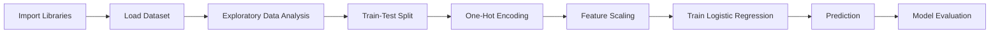

# 📉 Customer Churn Prediction


> A machine learning classification project that predicts customer churn using Logistic Regression — covering the complete workflow from raw data to evaluated model.

---

## 📖 Table of Contents

- [Overview](#-overview)
- [Dataset](#-dataset)
- [Technologies Used](#-technologies-used)
- [Project Workflow](#-project-workflow)
- [Results](#-results)
- [Project Structure](#-project-structure)
- [How to Run](#-how-to-run)
- [Future Improvements](#-future-improvements)
- [Author](#-author)

---

## 🎯 Overview

Customer churn prediction helps businesses identify customers who are likely to leave a service. Early detection allows companies to take proactive retention measures and reduce revenue loss.

This project builds a complete classification pipeline using **Logistic Regression** with Scikit-learn — starting from raw data preprocessing and ending with model evaluation.

---

## 📊 Dataset

The dataset contains customer information including:

| Feature | Description |
|---|---|
| `Age` | Customer's age |
| `Gender` | Customer's gender |
| `Subscription Type` | Type of subscription plan |
| `Contract Length` | Duration of the customer's contract |
| `Tenure` | How long the customer has been with the service |
| `Usage Frequency` | How often the customer uses the service |
| `Support Calls` | Number of support calls made |
| `Payment Delay` | Delay in payments |
| `Total Spend` | Total amount spent by the customer |
| `Last Interaction` | Recency of the customer's last interaction |

### Target Variable — `Churn`

| Value | Meaning |
|---|---|
| `0` | Customer stays |
| `1` | Customer leaves |

---

## 🛠️ Technologies Used

| Category | Tools |
|---|---|
| Language | Python |
| Numerical Computing | NumPy |
| Data Handling | Pandas |
| Visualization | Matplotlib |
| Machine Learning | Scikit-learn |
| Environment | Jupyter Notebook |

---

## 🔄 Project Workflow



### 1. Import Libraries
Imported the required libraries for data manipulation, preprocessing, model training, evaluation, and visualization.

### 2. Load the Dataset
Loaded the dataset with Pandas and separated the input features from the target variable. The `CustomerID` column was dropped, since it's only an identifier and carries no predictive value.

### 3. Exploratory Data Analysis (EDA)
Explored the dataset structure, data types, statistical summary, and missing values to confirm the data was clean before preprocessing.

### 4. Train-Test Split
Split the dataset into **80% training** and **20% testing** data *before* preprocessing, to prevent data leakage.

### 5. Data Preprocessing

**One-Hot Encoding** — applied `OneHotEncoder` to convert categorical features into numerical form:
- `Gender`
- `Subscription Type`
- `Contract Length`

**Feature Scaling** — applied `StandardScaler` to numerical features, improving the optimization behavior of Logistic Regression by putting features on a comparable scale.

### 6. Model Training
Trained a **Logistic Regression** classifier on the preprocessed training data.

### 7. Prediction
Used the trained model to predict churn on the held-out testing set.

### 8. Model Evaluation
Evaluated performance using a Confusion Matrix, Accuracy Score, and Classification Report.

---

## ✅ Results

### Model Accuracy

**Accuracy: 83.16%**

### Confusion Matrix

<p align="center">
  
</p>

### Classification Report

| Metric | Value |
|---|---:|
| Accuracy | **83.16%** |
| Precision | **0.83** |
| Recall | **0.83** |
| F1-Score | **0.83** |

The model achieved **balanced performance across both classes**, indicating it can classify churn and non-churn customers with consistent precision and recall — rather than skewing toward one class.

---

## 📁 Project Structure

```
Customer-Churn-Prediction/
│
├── Images/
│   └── confusion_matrix.png
├── data/
│   └── customer_churn.csv
├── notebooks/
│   └── customer_churn_prediction.ipynb
├── README.md
└── requirements.txt
```

---

## ▶️ How to Run

```bash
# 1. Clone the repository
git clone https://github.com/khaled-amireh/Customer-Churn-Prediction.git
cd Customer-Churn-Prediction

# 2. Install dependencies
pip install -r requirements.txt

# 3. Launch the notebook
jupyter notebook notebooks/customer_churn_prediction.ipynb
```

---

## 🚀 Future Improvements

- Hyperparameter tuning
- Feature selection
- Cross-validation
- ROC Curve and AUC Score
- Precision-Recall Curve

---

## 👤 Author

**Khaled Amireh**
[GitHub](https://github.com/khaled-amireh)
