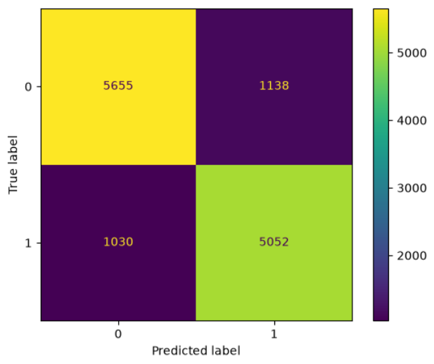

# Customer Churn Prediction using Logistic Regression

A machine learning classification project that predicts customer churn using Logistic Regression. The project covers the complete machine learning pipeline, including data preprocessing, model training, and performance evaluation.

---

# Overview

Customer churn prediction helps businesses identify customers who are likely to leave a service. Early detection allows companies to improve customer retention and reduce revenue loss.

In this project, I built a complete classification pipeline using Logistic Regression with Scikit-learn, starting from raw data preprocessing and ending with model evaluation.

---

# Dataset

The dataset contains customer information such as:

- Age
- Gender
- Subscription Type
- Contract Length
- Tenure
- Usage Frequency
- Support Calls
- Payment Delay
- Total Spend
- Last Interaction

### Target Variable

**Churn**

- **0** → Customer Stays
- **1** → Customer Leaves

---

# Technologies Used

- Python
- NumPy
- Pandas
- Matplotlib
- Scikit-learn
- Jupyter Notebook

---

# Project Workflow

## 1. Import Libraries

Imported the required libraries for:

- Data manipulation
- Data preprocessing
- Model training
- Model evaluation
- Data visualization

---

## 2. Load the Dataset

Loaded the dataset using Pandas and separated the input features from the target variable.

The **CustomerID** column was removed because it is only an identifier and does not contribute to the prediction process.

---

## 3. Exploratory Data Analysis (EDA)

Performed a basic exploration of the dataset by checking:

- Dataset information
- Data types
- Statistical summary
- Missing values

This step helped verify that the dataset was clean before preprocessing.

---

## 4. Train-Test Split

The dataset was divided into:

- 80% Training Data
- 20% Testing Data

Splitting the data before preprocessing helps prevent data leakage.

---

## 5. Data Preprocessing

### One-Hot Encoding

Applied **OneHotEncoder** to transform categorical features into numerical values.

Encoded columns:

- Gender
- Subscription Type
- Contract Length

---

### Feature Scaling

Applied **StandardScaler** to the numerical features.

Feature scaling improves the optimization process of Logistic Regression by placing numerical features on a similar scale.

---

## 6. Model Training

Trained a **Logistic Regression** classifier using the training dataset.

---

## 7. Prediction

Used the trained model to predict customer churn on the testing dataset.

---

## 8. Model Evaluation

The model was evaluated using:

- Confusion Matrix
- Accuracy Score
- Classification Report

---

# Results

### Model Accuracy

**Accuracy:** **83.16%**

### Confusion Matrix



### Classification Report

| Metric | Value |
|---------|------:|
| Accuracy | **83.16%** |
| Precision | **0.83** |
| Recall | **0.83** |
| F1-Score | **0.83** |

The model achieved balanced performance across both classes, indicating that it can classify churn and non-churn customers with consistent performance.

---

# Project Structure

```text
Customer-Churn-Prediction/
│
├── Images/
│   └── confusion_matrix.png
│
├── customer_churn_prediction.ipynb
├── customer_churn_prediction.py
├── customer_churn_dataset-testing-master.csv
├── README.md
├── requirements.txt
└── LICENSE
```

---

# Installation

```bash
git clone https://github.com/YOUR_USERNAME/customer-churn-prediction.git

cd customer-churn-prediction

pip install -r requirements.txt
```

---

# Running the Project

Run the notebook:

```bash
jupyter notebook customer_churn_prediction.ipynb
```

or run the Python script:

```bash
python customer_churn_prediction.py
```

---

# Future Improvements

Possible improvements include:

- Hyperparameter tuning
- Feature selection
- Cross-validation
- ROC Curve and AUC Score
- Precision-Recall Curve
- Comparing Logistic Regression with other classification algorithms

---
