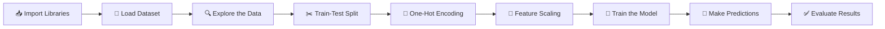
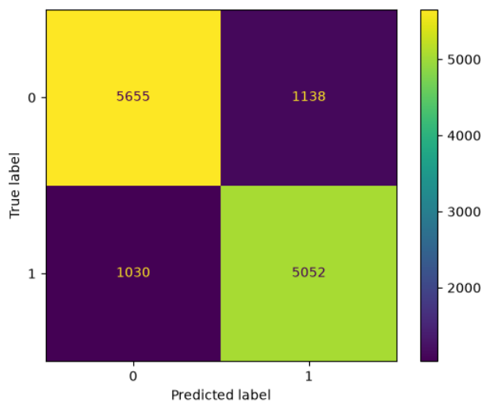

<p align="center">
  
</p>

<p align="center">
  
</p>

<p align="center">
  
  
  
  
</p>

<p align="center">
  <b>A machine learning project that predicts whether a customer will churn (leave) or stay — built end-to-end with Logistic Regression.</b>
</p>

---

##  Table of Contents

- [ Overview](#-overview)
- [ Dataset](#-dataset)
- [ Technologies Used](#-technologies-used)
- [ Project Workflow](#-project-workflow)
- [ Results](#-results)
- [ Project Structure](#-project-structure)
- [ How to Run](#️-how-to-run)
- [ Future Improvements](#-future-improvements)
- [ Author](#-author)

---

##  Overview

> **In simple terms:** this project teaches a computer to look at a customer's info (how long they've been subscribed, how often they use the service, how many times they called support, etc.) and predict one thing — **will they stay, or will they leave?**

Losing a customer is expensive. It's almost always cheaper to **keep** a customer happy than to find a brand-new one to replace them. So if a business can spot the customers who are *about to leave* ahead of time, they can step in early — a discount, a check-in call, a better offer — before it's too late.

That's exactly what this model does. It was built using **Logistic Regression**, a simple but powerful algorithm that's great at answering yes/no questions like *"will this customer churn?"*

```
 Raw customer data  →   Clean & prepare it  →   Train the model  →   See how accurate it is
```

---

##  Dataset

The model learns from everyday customer information — the kind of data most subscription businesses already have:

| Feature | What It Means |
|---|---|
| `Age` | Customer's age |
| `Gender` | Customer's gender |
| `Subscription Type` | Which plan they're on |
| `Contract Length` | How long their contract runs |
| `Tenure` | How long they've been a customer |
| `Usage Frequency` | How often they actually use the service |
| `Support Calls` | How many times they contacted support |
| `Payment Delay` | How late their payments tend to be |
| `Total Spend` | Total money spent so far |
| `Last Interaction` | How recently they were active |

### 🎯 What We're Predicting — `Churn`

| Value | Meaning |
|:---:|---|
| `0` | ✅ Customer stays |
| `1` | ❌ Customer leaves |

> 💡 The `CustomerID` column was removed — it's just a name tag, not useful information for predicting behavior.

---

## 🧰 Technologies Used

| Category | Tools |
|---|---|
| Language | 🐍 Python |
| Numbers & Math | NumPy |
| Data Handling | Pandas |
| Charts | Matplotlib |
| Machine Learning | Scikit-learn |
| Workspace | Jupyter Notebook |

---

## 🔄 Project Workflow


```mermaid
flowchart LR
    A[📥 Import Libraries] --> B[📂 Load Dataset]
    B --> C[🔍 Explore the Data]
    C --> D[✂️ Train-Test Split]
    D --> E[🔢 One-Hot Encoding]
    E --> F[📏 Feature Scaling]
    F --> G[🤖 Train the Model]
    G --> H[🔮 Make Predictions]
    H --> I[✅ Evaluate Results]
```

### 1. 📥 Import Libraries
Brought in the tools needed to handle data, build the model, and draw charts.

### 2. 📂 Load the Dataset
Loaded the data and separated it into **"the clues"** (features) and **"the answer"** (`Churn`). The `CustomerID` column was dropped since it's just a label, not a clue.

### 3. 🔍 Explore the Data (EDA)
Took a first look at the data — checked its shape, types, and whether anything was missing — to make sure it was clean before using it.

### 4. ✂️ Train-Test Split
Split the data into **80% for teaching the model** and **20% for testing it** — and did this *before* any other processing. This way, the model never "peeks" at the test answers while learning. Think of it like studying from one set of practice questions and then taking an exam with *different* questions.

### 5. 🔢 + 📏 Prepare the Data

**One-Hot Encoding** turns text categories (like `Gender` or `Subscription Type`) into numbers the model can actually understand, since computers can't do math on words.

**Feature Scaling** puts all the numeric features on the same scale — so a feature like `Total Spend` (which can be in the thousands) doesn't unfairly outweigh a feature like `Support Calls` (which might just be 0–5) when the model is learning.

### 6. 🤖 Train the Model
Fed the training data into a **Logistic Regression** model and let it learn the patterns that separate customers who stay from customers who leave.

### 7. 🔮 Make Predictions
Used the trained model to predict churn for customers it had **never seen before** — the test set.

### 8. ✅ Evaluate the Model
Checked how good those predictions actually were, using a Confusion Matrix, Accuracy Score, and Classification Report.

---

## 📊 Results

<div align="center">

### 🎯 Accuracy: **83.16%**

*Out of every 100 customers, the model correctly predicted stay-or-leave for about 83 of them.*

</div>

### Confusion Matrix — Who Did We Get Right?

<p align="center">
  
</p>

### Classification Report

| Metric | Value | In Plain Words |
|---|:---:|---|
| Accuracy | **83.16%** | Overall, correct 83% of the time |
| Precision | **0.83** | When it says "this customer will churn," it's right 83% of the time |
| Recall | **0.83** | Of all customers who *actually* churned, it caught 83% of them |
| F1-Score | **0.83** | A balanced score combining Precision and Recall |

> ✅ **Why this is good:** all three scores landed at the same number (0.83). That means the model isn't just "cheating" by guessing the most common outcome — it's genuinely good at spotting *both* customers who stay **and** customers who leave.

---

## 📁 Project Structure

```
Customer-Churn-Prediction/
│
├── Images/
│   └── confusion_matrix.png
├── data/
│   └── customer_churn.csv
├── notebooks/
│   └── customer_churn_prediction.ipynb
├── README.md
└── requirements.txt
```

---

## ▶️ How to Run

```bash
# 1. Clone the repository
git clone https://github.com/khaled-amireh/Customer-Churn-Prediction.git
cd Customer-Churn-Prediction

# 2. Install dependencies
pip install -r requirements.txt

# 3. Launch the notebook
jupyter notebook notebooks/customer_churn_prediction.ipynb
```

---

## 🚀 Future Improvements

- [ ] Hyperparameter tuning
- [ ] Feature selection
- [ ] Cross-validation
- [ ] ROC Curve and AUC Score
- [ ] Precision-Recall Curve

---

## 👤 Author

<p align="center">
  <b>Khaled Amireh</b><br/>
  <a href="https://github.com/khaled-amireh">🔗 GitHub</a>
</p>

<p align="center">
  
</p>
